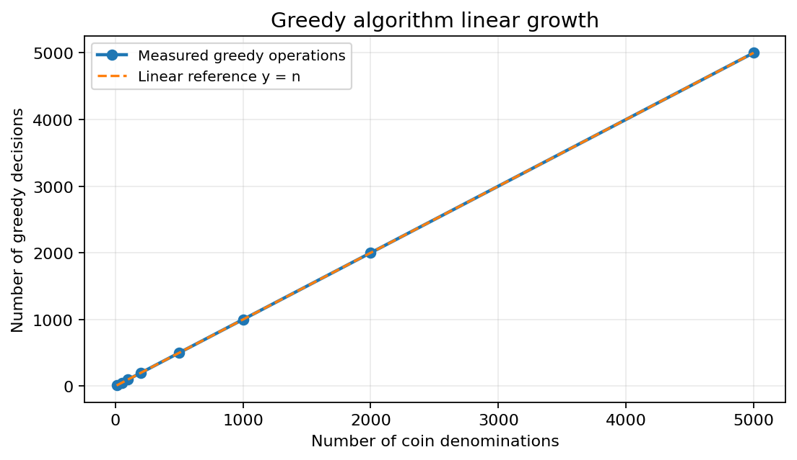
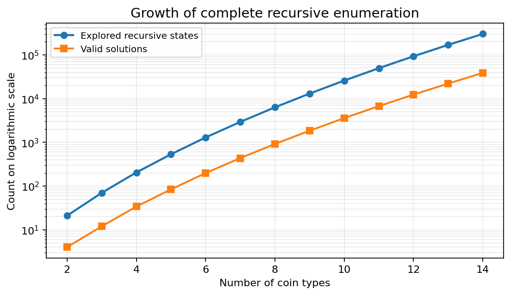
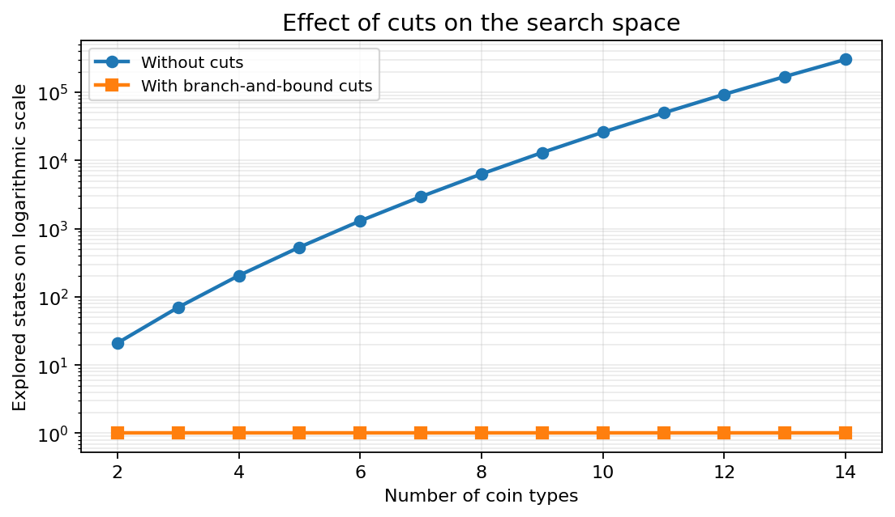

# Make Change Exact Solving in C++

This repository contains our C++ practical work on the **Make Change** problem. We compare greedy selection, complete recursive enumeration, exact recursive branch-and-bound with safe cuts, and bottom-up dynamic programming. For every method, our optimization objective is to represent the target amount with the minimum possible number of coins.

## Academic context

- **Course:**  Mobility in Smart Cities
- **University:** Université Marie et Louis Pasteur
- **Instructor:** Prof. Philippe Canalda
- **Students:** Ahmed Al-Muharaq and Owais Khan

This repository contains only the Make Change practical work (TP), not the separate mini-project.

## Problem definition

For the official instance, we use the denomination list

```text
L = [5, 2, 1, 0.50, 0.20, 0.10, 0.05]
```

and the target amount **M = EUR 12.35**. A solution is represented by a count vector `S`, where `S[i]` is the number of coins of denomination `L[i]`. A valid vector satisfies

```text
sum(S[i] * L[i]) = M
```

and our objective is

```text
minimize sum(S[i])
```

The implementation converts every denomination and amount to integer cents (for example, EUR 12.35 becomes `1235`). This avoids floating-point rounding errors when testing whether a combination exactly reaches the target.

## Implemented algorithms

1. **Ordered greedy algorithm.** We scan denominations in decreasing order and select as many coins as possible at each step.
2. **Greedy with an unordered list.** We deliberately apply the same selection rule to the supplied order to demonstrate that ordering matters.
3. **Input normalization.** We sort an arbitrary denomination list in decreasing order before applying greedy selection.
4. **Complete recursive enumeration.** We enumerate every valid count vector and record both the number of solutions and the number of explored states.
5. **Improving-incumbent sequence.** During exact search, we retain each solution that improves the best known coin count.
6. **Recursive branch-and-bound.** We use safe feasibility and lower-bound cuts to prune branches that cannot improve the incumbent while preserving exactness.
7. **Bottom-up dynamic programming.** We independently compute the minimum coin count to verify the recursive optimum.

## Complexity analysis

Let `n` be the number of denominations and let `M` be the target amount represented in cents.

| Method | Time complexity | Additional memory |
|---|---:|---:|
| Ordered greedy scan | `O(n)` | `O(n)` for the returned count vector |
| Greedy with decreasing sort | `O(n log n)` | Depends on the sorting implementation |
| Complete recursive enumeration | Exponential in the worst case | Proportional to recursion depth, excluding stored results |
| Exact branch-and-bound | Exponential in the worst case | Proportional to recursion depth and incumbent storage |
| Bottom-up dynamic programming | `O(nM)` | `O(M)` |

Branch-and-bound can reduce the practical search substantially, but it remains an exact exponential-time method in the worst case.

## Official experimental results

| Experiment | Result |
|---|---:|
| Ordered greedy | 6 coins |
| Unordered list used directly | 64 coins |
| Unordered list after sorting | 6 coins |
| Complete recursive enumeration - valid solutions | 266,724 |
| Complete recursive enumeration - explored states | 12,607,231 |
| Exact recursive search with cuts - explored states | 18 |
| Exact recursive search - pruned states | 10 |
| Dynamic programming | Confirms the 6-coin optimum |

The six-coin optimum is two EUR 5 coins, one EUR 2 coin, one EUR 0.20 coin, one EUR 0.10 coin, and one EUR 0.05 coin.

## Counterexamples

The denomination set `[4, 3, 1]` with amount `6` shows that greedy selection need not be optimal. Greedy selects `4 + 1 + 1`, using three coins, whereas exact search finds `3 + 3`, using only two coins.

The denomination set `[5, 2, 1.5]` with amount `9.5` shows a stronger failure. Greedy selects `5 + 2 + 2` and becomes stuck with `0.5`, so it finds no exact representation. Exact search finds `5 + 1.5 + 1.5 + 1.5`, a valid four-coin solution.

These examples demonstrate that the first solution—or a greedy solution—is not always optimal and may not even be feasible when an exact solution exists.

## Complexity curves

The first benchmark varies the number of denominations. The resulting curve confirms the linear growth of the ordered greedy scan.



The measured operation count grows directly with the denomination count, in agreement with the `O(n)` analysis. Sorting an unordered input adds the expected normalization cost.

The second benchmark records the states visited by complete recursive enumeration as the instance grows. Its vertical axis is logarithmic so that the rapid growth remains readable.



The curve makes the combinatorial growth of exhaustive recursion visible and illustrates why enumeration becomes impractical much sooner than greedy scanning.

The third figure compares the number of explored states with and without branch-and-bound cuts.



The cuts eliminate most of the search on these structured benchmark instances. In particular, the one-state cut result is a **structured best-case benchmark**, not a constant-time guarantee: branch-and-bound is still exponential in the worst case.

## Project structure

```text
.
├── make_change.cpp
├── plot_make_change_curves.py
├── greedy_complexity.csv
├── recursive_complexity.csv
├── curve_greedy_linear.png
├── curve_recursive_growth.png
├── curve_cut_effect.png
├── make_change_output.txt
├── README.md
└── report/
    └── Make_Change_Practical_Work_Report.pdf
```

## Requirements

- A C++17 compiler, such as GCC
- Python 3
- `pandas`
- `matplotlib`

Install the Python dependencies with:

```bash
python3 -m pip install pandas matplotlib
```

## Compilation and execution

On Linux or macOS:

```bash
g++ -std=c++17 -O2 -Wall -Wextra -pedantic make_change.cpp -o make_change
./make_change
```

On Windows PowerShell:

```powershell
g++ -std=c++17 -O2 -Wall -Wextra -pedantic .\make_change.cpp -o .\make_change.exe
.\make_change.exe
```

## Benchmark and curve generation

On Windows PowerShell, reproduce the benchmark data and figures with:

```powershell
.\make_change.exe --benchmark
py .\plot_make_change_curves.py
```

Benchmark mode creates `greedy_complexity.csv` and `recursive_complexity.csv`. The plotting script reads those files and creates `curve_greedy_linear.png`, `curve_recursive_growth.png`, and `curve_cut_effect.png`.

## Reproducibility

We report explored-state and operation counts because they are more reproducible than wall-clock timings. Timing measurements depend on the machine, compiler, compiler options, operating system, and background load. Generated executables are intentionally excluded from GitHub; users can rebuild them from `make_change.cpp` with the commands above.

## Authors

- Ahmed Al-Muharaq
- Owais Khan

## Report

The complete academic report is available here: [Make Change Practical Work Report](report/Make_Change_Practical_Work_Report.pdf).
